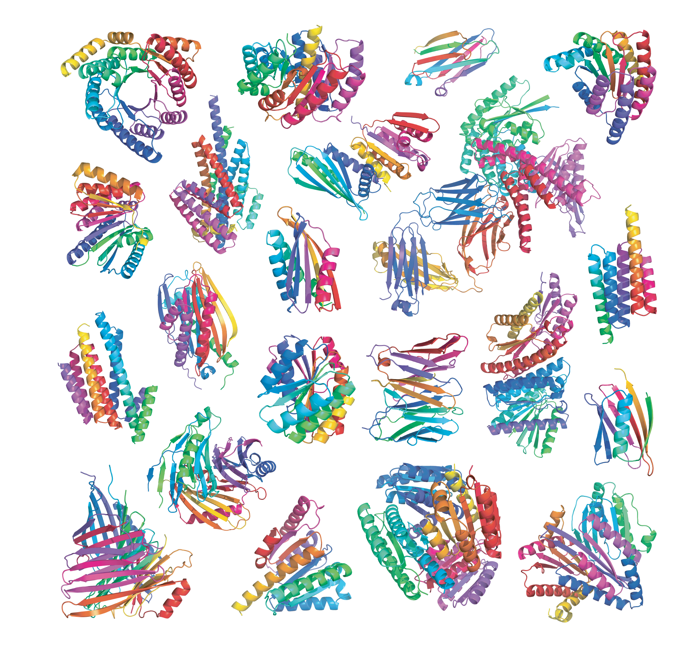
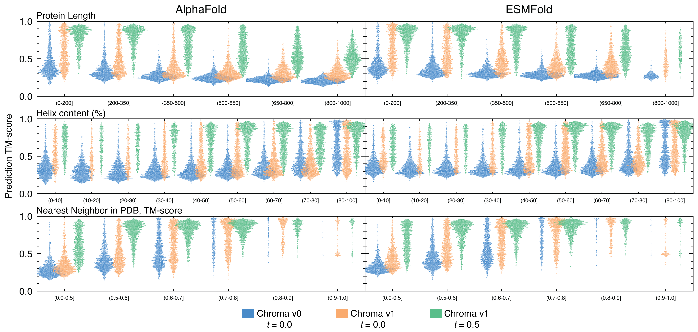
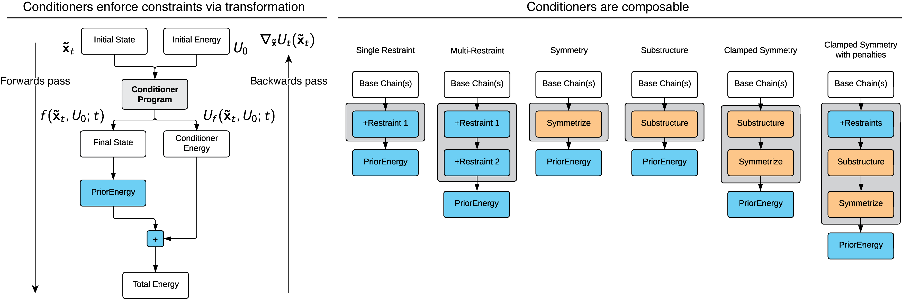
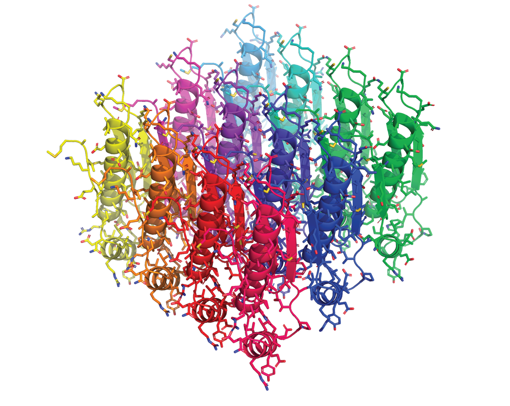

[**Get Started**](#get-started)
| [**Sampling**](#sampling)
| [**Design**](#design)
| [**Conditioners**](#conditioners)
| [**License**](#license)

Chroma is a generative model for designing proteins **programmatically**.

Protein space is complex and hard to navigate. With Chroma, protein design problems are represented in terms of [composable building blocks](#conditioners) from which diverse, [all-atom protein structures can be automatically generated](#sampling). As a joint model of structure and sequence, Chroma can also be used for common protein modeling tasks such as [generating sequences given backbones](#design), packing side-chains, and scoring designs. 

We provide protein conditioners for a variety of constraints, including substructure, symmetry, shape, and neural-network predictions of some protein classes and annotations. We also provide an API for [creating your own conditioners](#conditioners-api) in a few lines of code.

Internally, Chroma uses diffusion modeling, equivariant graph neural networks, and conditional random fields to efficiently sample all-atom structures with a complexity that is sub-quadratic in the number of residues. It can generate large complexes in a few minutes on a commodity GPU. You can read more about Chroma, including biophysical and crystallographic validation of some early designs, in our paper, [*Illuminating protein space with a programmable generative model*. Nature 2023](https://doi.org/10.1038/s41586-023-06728-8). 

<div align="center">

</div>

## Get Started
> **Note:** An API key is required to download and use the pretrained model weights. It can be obtained [here](https://chroma-weights.generatebiomedicines.com/).


**Colab Notebooks**. The quickest way to get started with Chroma is our Colab notebooks, which provide starting points for a variety of use cases in a preconfigured, in-browser environment

* [Chroma Quickstart](https://colab.research.google.com/github/generatebio/chroma/blob/main/notebooks/ChromaDemo.ipynb): GUI notebook demonstrating unconditional and conditional generation of proteins with Chroma.
* [Chroma API Tutorial](https://colab.research.google.com/github/generatebio/chroma/blob/main/notebooks/ChromaAPI.ipynb): Code notebook demonstrating protein I/O, sampling, and design configuration directly in `python`.
* [Chroma Conditioner API Tutorial](https://colab.research.google.com/github/generatebio/chroma/blob/main/notebooks/ChromaConditioners.ipynb): A deeper dive under the hood for implementing new Chroma [Conditioners](#conditioner-api).

**PyPi package**.You can install the latest release of Chroma with:
```
pip install generate-chroma
```

**Install latest Chroma from github**
```
git clone https://github.com/generatebio/chroma.git
pip install -e chroma # use `-e` for it to be editable locally. 
```

## Sampling
**Unconditional monomer**. We provide a unified entry point to both unconditional and conditional protein design with the `Chroma.sample()` method. When no conditioners are specified, we can sample a simple 200-amino acid monomeric protein with
```python
from chroma import Chroma

chroma = Chroma()
protein = chroma.sample(chain_lengths=[200])

protein.to("sample.cif")
display(protein)
```

Generally, `Chroma.sample()` takes as input design hyperparameters and [Conditioners](#conditioners) and outputs `Protein` objects representing the all-atom structures of protein systems which can be loaded to and from disk in PDB or mmCIF formats.

**Unconditional complex**. To sample a complex instead of a monomer, we can simply do
```python
from chroma import Chroma

chroma = Chroma()
protein = chroma.sample(chain_lengths=[100, 200])

protein.to("sample-complex.cif")
```

**Conditional complex**. We can further customize sampling towards design objectives via [Conditioners](#conditioners) and sampling hyperparameters. For example, to sample a C3-symmetric homo-trimer with 100 residues per monomer, we can do

```python
from chroma import Chroma, conditioners

chroma = Chroma()
conditioner = conditioners.SymmetryConditioner(G="C_3", num_chain_neighbors=2)
protein = chroma.sample(
    chain_lengths=[100],
    conditioner=conditioner,
    langevin_factor=8,
    inverse_temperature=8,
    sde_func="langevin",
    potts_symmetry_order=conditioner.potts_symmetry_order)

protein.to("sample-C3.cif")
```

Because compositions of conditioners are conditioners, even relatively complex design problems can follow this basic usage pattern. See the [demo notebooks](#get-started) and docstrings for more information on hyperparameters, conditioners, and starting points.

## Design
**Robust design**. Chroma is a joint model of sequence and structure that uses a common graph neural network base architecture to parameterize both backbone generation and conditional sequence and sidechain generation. These sequence and sidechain decoders are *diffusion-aware* in the sense that they have been trained to predict sequence and side chain not just for natural structures at diffusion time $t=0$ but also on noisy structures at all diffusion times $t \in [0,1]$. As a result, the $t$ hyperpameter of the design network provides a kind of tunable robustness via **diffusion augmentation** in we trade off between how much the model attempts to design the backbone *exactly* as specified (e.g. $t=0.0$) versus *robust* design within a small neighborhood of nearby backbone conformations (e.g. $t=0.5$).

While all results presented in the Chroma [publication](https://doi.org/10.1038/s41586-023-06728-8) were done with **exact design** at $t=0.0$, we have found **robust design** at times near $t=0.5$ frequently improves one-shot refolding while incurring only minor, often Ångstrom-scale, relaxation adjustments to target backbones. When we compare the performance of these two design modes on our set of 50,000 unconditional backbones that were analyzed in the paper, we see very large improvements in refolding across both [AlphaFold](https://github.com/google-deepmind/alphafold) and [ESMFold](https://github.com/facebookresearch/esm) that stratifies well across protein length, percent helicity, or similarity to a known structure (See Chroma [Supplementary Figure 14](https://doi.org/10.1038/s41586-023-06728-8) for further context).


<div align="center">

</div></br>

The value of diffusion time conditioning $t$ can be set via the `design_t` parameter in `Chroma.sample` and `Chroma.design`. We find that for generated structures, $t = 0.5$ produces highly robust refolding results and is, therefore, the default setting. For experimentally-precise structures, $t = 0.0$ may be more appropriate, and values in between may provide a useful tradeoff between these two regimes.

**Design *a la carte***. Chroma's design network can be accessed separately to design, redesign, and pack arbitrary protein systems. Here we load a protein from the PDB and redesign as
```python
# Redesign a Protein
from chroma import Protein, Chroma
chroma = Chroma()

protein = Protein('1GFP')
protein = chroma.design(protein)

protein.to("1GFP-redesign.cif")
```

Clamped sub-sequence redesign is also available and compatible with a built-in selection algebra, along with position- and mutation-specific mask constraints as
```python
# Redesign a Protein
from chroma import Protein, Chroma
chroma = Chroma()

protein = Protein('my_favorite_protein.cif') # PDB is fine too
protein = chroma.design(protein, design_selection="resid 20-50 around 5.0") #  5 angstrom bubble around indices 20-50

protein.to("my_favorite_protein_redesign.cif")
```

We provide more examples of design in the [demo notebooks](#get-started).

## Conditioners
Protein design with Chroma is **programmable**. Our `Conditioner` framework allows for automatic conditional sampling under arbitrary compositions of protein specifications, which can come in the forms of restraints (biasing the distribution of states) or constraints (directly restrict the domain of underlying sampling process); see Supplementary Appendix M in [our paper](https://doi.org/10.1038/s41586-023-06728-8). We have pre-defined multiple conditioners, including for controlling substructure, symmetry, shape, semantics, and natural-language prompts (see `chroma.layers.structure.conditioners`), which can be used in arbitrary combinations.

<div align="center">

| Conditioner | Class(es) in [`chroma.conditioners`](chroma/layers/structure/conditioners.py) | Example applications |
|----------|----------|----------|
| Symmetry constraint | `SymmetryConditioner`, `ScrewConditioner` | Large symmetric assemblies |
| Substructure constraint | `SubstructureConditioner` | Substructure grafting, scaffold enforcement |
| Shape restraint | `ShapeConditioner` | Molecular shape control |
| Secondary structure | `ProClassConditioner` | Secondary-structure specification |
| Domain classification | `ProClassConditioner` | Specification of class, such as Pfam, CATH, or Taxonomy |
| Text caption | `ProCapConditioner` | Natural language prompting |
| Sequence | `SubsequenceConditioner` | Subsequence constraints.  |

</div>

**How it works**. The central idea of Conditioners is *composable state transformations*, where each Conditioner is a function that modifies the state and/or energy of a protein system in a differentiable way ([Supplementary Appendix M](https://doi.org/10.1038/s41586-023-06728-8)). For example, to encode symmetry as a *constraint* we can take as input the assymetric unit and tesselate it according to the desired symmetry group to output a protein system that is symmetric by construction. To encode something like a neural network restraint, we can adjust the total system energy by the negative log probability of the target condition. For both of these, we add on the diffusion energy to the output of the Conditioner(s) and then backpropagate the total energy through all intermediate transformations to compute the unconstrained forces that are compatible with generic sampling SDE such as annealed Langevin Dynamics. 

We schematize this overall Conditioners framework below.
<div align="center">
<br>
<figcaption><i>The <code>Conditioner</code> class is the composable building block of protein design with Chroma.</i></figcaption>
</div>

#### Conditioner API
It is simple to develop new conditioners. A `Conditioner` is a Pytorch `nn.Module` which takes in the system state - i.e. the structure, energy, and diffusion time - and outputs potentially updated structures and energies as 

```python

class Conditioner(torch.nn.Module):
    """A composable function for parameterizing protein design problems.
    """
    def __init__(self, *args, **kwargs):
        super().__init__()
        # Setup your conditioner's hyperparameters

    def forward(
        self,
        X: torch.Tensor,                # Input coordinates
        C: torch.LongTensor,            # Input chain map (for complexes)
        O: torch.Tensor,                # Input sequence (one-hot, not used)
        U: torch.Tensor,                # Input energy (one-hot, not used)
        t: Union[torch.Tensor, float],  # Diffusion time
    ):
        # Update the state, e.g. map from an unconstrained to constrained manifold
        X_update, C_update  = update_state(X, C, t)

        # Update the energy, e.g. add a restraint potential
        U_update = U + update_energy(X, C, t)
        return X_update, C_update, O, U_update, t
```
 Roughly speaking, `Conditioner`s are composable by construction because their input and output type signatures are matched (i.e. they are an endomorphism). So we also simply build conditioners from conditioners by "stacking" them much as we would with traditional neural network layer developemnt. With the final `Conditioner` as an input, `Chroma.sample()` will then leverage Pytorch's automatic differentiation facilities to automaticallly furnish a diffusion-annealed MCMC sampling algorithm to sample with this conditioner (We note this isn't magic and taking care to scale and parameterize appropriately is [important](#note-on-conditioners)).

##### A minimal Conditioner: 2D lattice symmetry
The code snippet below shows how in a few lines of code we can add a conditioner that stipulates the generation of a 2D crystal-like object, where generated proteins are arrayed in an `M x N` rectangular lattice.

```python
import torch
from chroma.models import Chroma
from chroma.layers.structure import conditioners

class Lattice2DConditioner(conditioners.Conditioner):
    def __init__(self, M, N, cell):
        super().__init__()
        # Setup the coordinates of a 2D lattice
        self.order = M*N
        x = torch.arange(M) * cell[0]
        y = torch.arange(N) * cell[1]
        xx, yy = torch.meshgrid(x, y, indexing="ij")
        dX = torch.stack([xx.flatten(), yy.flatten(), torch.zeros(M * N)], dim=1)
        self.register_buffer("dX", dX)
        
    def forward(self, X, C, O, U, t): 
        # Tesselate the unit cell on the lattice
        X = (X[:,None,...] + self.dX[None,:,None,None]).reshape(1, -1, 4, 3)
        C = torch.cat([C + C.unique().max() * i for i in range(self.dX.shape[0])], dim=1)
        # Average the gradient across the group (simplifies force scaling)
        X.register_hook(lambda gradX: gradX / self.order)
        return X, C, O, U, t
    
chroma = Chroma().cuda()
conditioner = Lattice2DConditioner(M=3, N=4, cell=[20., 15.]).cuda()
protein = chroma.sample(
    chain_lengths=[70], conditioner=conditioner, sde_func='langevin',
    potts_symmetry_order=conditioner.order
)

protein.to_CIF("lattice_protein.cif")
```

<div align="center">

</div>

#### Note on Conditioners

An attractive aspect of this conditioner framework is that it is very general, enabling both constraints (which involve operations on $x$) and restraints (which amount to changes to $U$). At the same time, generation under restraints can still be (and often is) challenging, as the resulting effective energy landscape can become arbitrarily rugged and difficult to integrate. We therefore advise caution when using and developing new conditioners or conditioner combinations. We find that inspecting diffusition trajectories (including unconstrained and denoised trajectories, $\hat{x}_t$ and $\tilde{x}_t$) can be a good tool for identifying integration challenges and defining either better conditioner forms or better sampling regimes.

## Citing Chroma

If you use Chroma in your research, please cite:

J. B. Ingraham, M. Baranov, Z. Costello, K. W. Barber, W. Wang, A. Ismail, V. Frappier, D. M. Lord, C. Ng-Thow-Hing, E. R. Van Vlack, S. Tie, V. Xue, S. C. Cowles, A. Leung, J. V. Rodrigues, C. L. Morales-Perez, A. M. Ayoub, R. Green, K. Puentes, F. Oplinger, N. V. Panwar, F. Obermeyer, A. R. Root, A. L. Beam, F. J. Poelwijk, and G. Grigoryan, "Illuminating protein space with a programmable generative model", *Nature*, 2023 (10.1038/s41586-023-06728-8).

```bibtex
@Article{Chroma2023,
  author  = {Ingraham, John B. and Baranov, Max and Costello, Zak and Barber, Karl W. and Wang, Wujie and Ismail, Ahmed and Frappier, Vincent and Lord, Dana M. and Ng-Thow-Hing, Christopher and Van Vlack, Erik R. and Tie, Shan and Xue, Vincent and Cowles, Sarah C. and Leung, Alan and Rodrigues, Jo\~{a}o V. and Morales-Perez, Claudio L. and Ayoub, Alex M. and Green, Robin and Puentes, Katherine and Oplinger, Frank and Panwar, Nishant V. and Obermeyer, Fritz and Root, Adam R. and Beam, Andrew L. and Poelwijk, Frank J. and Grigoryan, Gevorg},
  journal = {Nature},
  title   = {Illuminating protein space with a programmable generative model},
  year    = {2023},
  volume  = {},
  number  = {},
  pages   = {},
  doi     = {10.1038/s41586-023-06728-8}
}
```

## Acknowledgements
The Chroma codebase is the work of many contributers at Generate Biomedicines. We would like to acknowledge: Ahmed Ismail, Alan Witmer, Alex Ramos, Alexander Bock, Ameya Harmalkar, Brinda Monian, Craig Mackenzie, Dan Luu, David Moore, Frank Oplinger, Fritz Obermeyer, George Kent-Scheller, Gevorg Grigoryan, Jacob Feala, James Lucas, Jenhan Tao, John Ingraham, Martin Jankowiak, Max Baranov, Meghan Franklin, Mick Ward, Rudraksh Tuwani, Ryan Nelson, Shan Tie, Vincent Frappier, Vincent Xue, William Wolfe-McGuire, Wujie Wang, Zak Costello, Zander Harteveld.

## License

Copyright Generate Biomedicines, Inc.

### Chroma Code License
Licensed under the Apache License, Version 2.0 (the "License"); you may not use this code except in compliance with the License. You may obtain a copy of the License at https://www.apache.org/licenses/LICENSE-2.0.

Unless required by applicable law or agreed to in writing, software distributed under the License is distributed on an "AS IS" BASIS, WITHOUT WARRANTIES OR CONDITIONS OF ANY KIND, either express or implied, including, without limitation, any warranties or conditions of TITLE, NON-INFRINGEMENT, MERCHANTABILITY, or FITNESS FOR A PARTICULAR PURPOSE. See the License for the specific language governing permissions and limitations under the License.

### Model Weights License
Chroma weights are freely available to academic researchers and non-profit entities who accept and agree to be bound under the terms of the Chroma Parameters License. Please visit the [weights download page](https://chroma-weights.generatebiomedicines.com/) for more information. If you are not eligible to use the Chroma Parameters under the terms of the provided License or if you would like to share the Chroma Parameters and/or otherwise use the Chroma Parameters beyond the scope of the rights granted in the License (including for commercial purposes), you may contact the Licensor at: licensing@generatebiomedicines.com.
